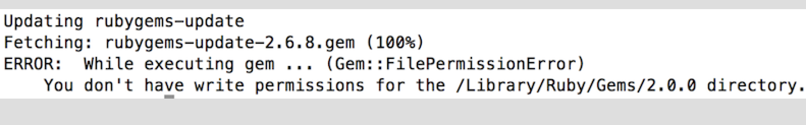

#CocoaPods 

`iOS` `OSX` `代码管理` `效率`

Cocoapods是OS X和iOS下的一个第三类库管理工具，通过CocoaPods工具我们可以为项目添加被称为“Pods”的依赖库 **这些类库必须是CocoaPods本身所支持的** 并且可以轻松管理其版本,项目的[源码](https:github.com/CocoaPods/CocoaPods)在github上管理,始于2011.8

##CocoaPods的好处
* 在引入第三方库时它可以自动为我们完成各种各样的配置，包括配置
    编译阶段、连接器选项、甚至是ARC环境下的-fno-objc-arc配置	 等;
* 自动下载第三方开源库的的源代码,并且添加对应依赖的framework;

## Cocoapods安装步骤
**1.升级Ruby环境**
如果gem版本太老,可尝试如下命令升级gem

~~~
终端输入:gem update --system
~~~

若出现一下情况,这是因为你没有权限升级Ruby.可输入

```
sudo gem update --system
```


**2.更换Ruby镜像**
>首先移除现有的Ruby镜像,因为ruby的软件源rubygem.org使用了亚马逊的云服务被屏蔽了,所以需要更新一下ruby的源,改换为淘宝的源:
em sources --remove https://rubygems.org/ 首先移除现有的Ruby镜像
gem source -a https://gems.ruby-china.org/ 然后添加国内最新镜像源
gem sources -l //执行完毕之后输入gem sources -l来查看当前镜像

说明添加成功，否则继续执行$ gem source -a https://gems.ruby-china.org/

**3.安装CocoaPods**
>安装命令：`sudo gem install cocoapods`,若出现以下情况:

说明没有权限,需要终端输入：`sudo gem install -n /usr/local/bin cocoapods`之后执行 pod setup 该过程等待时间比较久.你可以command+n新建一个终端窗口，执行cd ~/.cocoapods/进入到该文件夹下，然后执行du -sh *来查看文件大小，每隔几分钟查看一次，这个目录最终大小是900多M
当出现`Setup completed`的时候说明已经完成了.

- **3.1参考巧神的小秘诀**
>“使用CocoaPods的镜像索引” 可提高下载速度,可依次输入如下命令：
pod repo remove master
pod repo add master https:gitcafe.com/akuandev/Specs.git
pod repo update

**4.CocoaPods的使用**
- **4.1首先我们来搜索一下三方库 **
>终端输入: `pod search AFNetworking`
若出现以下情况：
这是因为之前pod search的时候生成了缓存文件search_index.json
执行rm ~/Library/Caches/CocoaPods/search_index.json来删除该文件
然后再次输入pod search AFNetworking进行搜索
这时会提示Creating search index for spec repo 'master'..
等待一会将会出现结果了

- **4.2在工程中创建一个Podfile文件 **
>要想在你的工程中创建Podfile文件 cd ….(该工程目录路径)
必须先要进到该工程目录下,进来之后就创建     touch Podfile
然后你在你的工程目录下可以看到多了一个Podfile文件如下：

- **4.3编辑你想导入的第三方库的名称及版本 **
>使用vim编辑Podfile文件 终端输入：vim Podfile 
假如我要安装AFNetworking,编辑完之后成如下样子
platform :ios, '7.0'代表当前AFNetworking支持的iOS最低版本是iOS 7.0,
‘CocoaProject’就是你自己的工程名字,
pod 'AFNetworking', '~> 3.1.0'代表要下载的AFNetworking版本是3.1.0及以上版本，还可以去掉后面的'~> 3.1.0'，直接写pod 'AFNetworking'，这样代表下载的AFNetworking是最新版

- **4.4把该库下载到Xcode中**
>`pod install`这就开始下载了，需要一段时间，出现如下界面就说明安装好了这个时候关闭所有的Xcode窗口，再次打开工程目录会看到多了一个后缀名为.xcworkspace文件
>以后打开工程就双击这个文件打开了，而不再是打开.xcodeproj文件。
进入工程后引入头文件不再是#import "AFNetworking.h"，而是#import <AFNetworking.h>
此刻说明CocoaPods 安装完成了.

- **4.5注意事项 **
>当你执行 pod install 除了Podfile文件外,还会生成一个Podfile.lock的文件，该文件会锁定当前各依赖库的版本,之后执行安装命令也不会更改版本，只有更新命令才会改变Podfile.lock.这样可以防止第三方库升级时造成第三方库版本不一样.

---------
### 实现原理
CocoaPods 的原理是将所有的依赖库都放到一个名为Pods项目中，然后让主项目依赖Pods项目,这样,源码管理工作都从主项目移到了Pods项目中.下面是一些技术细节:
1.Pods项目最终会编译成一个名为libPods.a,主项目只需要依赖这个.a文件即可
2.对于资源文件,CocoaPods提供了一个名为Pods-resources.sh的bash脚本,该脚本在每次项目编译的时候都会执行,将第三方库的各种资源复制到目标目录中.
3.CocoaPods 通过一个名为Pods.xcconfig的文件在编译时设置所有的依赖和参数.


